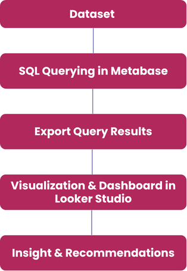
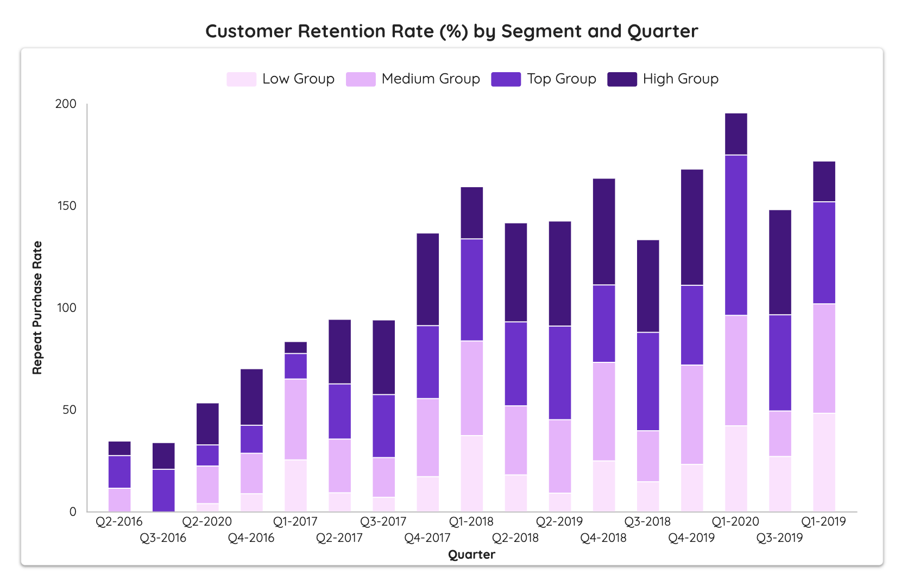

# RETAIL-SALES-PERFORMANCE-ANALYSIS

## About Dataset  
- **Rows:** 18,761  
- **Columns:** 15  
  - *Sales ID, Created At, Quantity, Gross Sales, Discount, Tax, Net Sales, Product ID, Product Name, Category, Customer ID, Customer Name, Customer City, Customer State, Customer Source*  
- **Time Range:** 01/10/2016 – 09/04/2020  
- **Data Type:** Transaction-level retail sales data  

## 📊 Interactive Dashboard

This project also includes an **interactive dashboard** for exploring stock data.  
You can preview it below and click the link to interact with the live version.

  

[🔗 View Interactive Dashboard](https://lookerstudio.google.com/u/0/reporting/e17e5b93-9c07-4ee5-9d0a-091b78eaee6c)

---

## 🎯 Business Objectives  
### Section 1: Business Performance Overview  
### Section 2: Customer Retention & Discount Impact  

**Key Business Questions:**  
- Which products/categories contribute the most to revenue?  
- What is the revenue trend across quarters/years?  
- How does revenue vary by region/state/customer source?  
- What is the repeat purchase rate by customer segment across quarters?  
- Does discounting have a positive impact on revenue?  
- What is the optimal discount percentage?  

---

## 🔍 Methodology  

### 1. Data Extraction & Preparation  
- **SQL (PostgreSQL):** Querying and aggregating raw sales data  
- **Metabase:** Running SQL queries and exporting clean datasets  

### 2. Data Analysis  
- **Metabase:** Exploratory Data Analysis (EDA) and ad-hoc queries  
- **Excel / Google Sheets:** Additional cleaning & quick checks  

### 3. Data Visualization & Dashboarding  
- **Metabase:** Quick visual insights for internal review  
- **Looker Studio:** Interactive dashboards for business stakeholders

## 🛒 Retail Sales Analysis Workflow  

**Step 1 – Understanding the Dataset**  
- Reviewed the preloaded retail sales dataset in Metabase (15 columns, 18,761 rows).  
- Familiarized with the data structure, fields, and time range (2016–2020).  

**Step 2 – SQL Querying in Metabase**  
- Wrote SQL queries to calculate:  
  - Yearly & quarterly revenue and YoY growth.  
  - Revenue by product, category, and region.  
  - Discount impact analysis.  
  - Repeat Purchase Rate (RPR) by customer segment.  

**Step 3 – Exporting Data**  
- Exported SQL query results from Metabase into CSV format for visualization.  

**Step 4 – Dashboard Creation in Looker Studio**  
- Exported query results from Metabase.  
- Built an interactive dashboard in Looker Studio with:  
  - **Page 1**: Business Performance Overview.  
  - **Page 2**: Customer Retention & Discount Impact.  

**Step 5 – Insights & Recommendations**  
- Derived actionable business insights from the dashboard.  
- Suggested strategies for revenue growth and customer retention.  

## 📊 Business Performance Overview (2016–2020)  

### By Time (Yearly & Quarterly)  

  

**Insights:**  
- **Revenue peaked in 2019 ($1,344,223)**, but *YoY growth rate declined from 2017–2019*.  
- **Data gap**: Trend chart (2016–2020) does not fully reflect 2016 & 2020 since dataset covers only *Q2-2016 → Q2-2020*.  
- Despite revenue fluctuations, **transactions and units sold increased steadily** → *long-term demand remained strong*.  

**Quarterly trends:**  

 

**Insights:**  
- **Q2–2016 → Q4–2016**: Revenue rose from *16,530 → 75,434*, but dropped sharply in **Q1–2017 (51,709)**.  
  - Discounts were applied (0.69%) but ineffective, mostly targeting *Low Group customers* while discount range stayed at **Top Range**.  
- **Q1–2018**: Revenue fell by >50% vs Q4–2017 → *ineffective promotions*.  
- **Late 2018 – early 2019**: Another **53.5% decline**, partly due to *early COVID-19 impact & weak discount strategy*.  
- **Q1–2020 → Q2–2020**: Steepest revenue drop during **COVID-19 crisis**; business reacted too slowly (*still operating in “High” discount range*).

## By Product & Category 

  

**Insights:**  
- **Top 10 products** (knives, wallets, gloves, coats, cars, desktops, etc.) are spread across *multiple categories* → not concentrated in a single one.

  

- **Revenue is distributed evenly across 4 categories**, with **Widget leading (28.1%)**.  
  - Widget shows **low sensitivity to discount**, making it *more resilient*.  
  - Other categories’ revenue is **discount-driven**.
 
  ## By Geo-Locations

  

**Insights:**  
- **Revenue distribution is balanced**, no extreme outliers.  
- **Top 10 cities** range between *$9,943 – $12,493*.  
- **City-level patterns differ:**  
  - **Petersville, AK**: AOV = $1,706, revenue = $3,413 → very few high-value orders.  
  - **Troy, ID**: AOV = $624, revenue = $2,498 → similar case.  
  - **Tunnelton, WV**: AOV = $824, revenue = $11,545.  
  - **Abilene, KS**: AOV = $642, revenue = $10,278.  

**Implications:**  
- **High AOV ≠ High Revenue** → some regions rely on a handful of large-ticket purchases → unsustainable.  
- **Priority markets** = High AOV + stable revenue → more reliable growth opportunities.  
- **Niche luxury markets** (high AOV, low revenue) → potential for experimentation but *not for scale*.  

## By Customer Source  

 

**Insights:**  
- **Revenue contribution is evenly distributed across channels**, with no single source dominating.  
- **Google Search** delivers slightly higher revenue → strong match between *search intent* and **product categories** (household & personal items).  
- **Affiliate** shows relatively lower performance but remains close to other channels → *untapped potential*.  

**Implications:**  
- A **balanced channel mix** reduces dependency risk.  
- **Google Search** demonstrates efficiency in capturing high-intent customers.  
- **Affiliate lags** behind but could be optimized to improve performance.  

## Customer Retention & Discount Impact  

  

  

**Insights:**  
- **Low Group** = *price-sensitive*, responds to discounts but delivers **low AOV**.  
- **Medium–Top Groups** = less discount-sensitive, willing to spend more.  
- **Widget category** = least affected by discount levels.  
- **Optimal discount range** = **Medium** → correlated with **higher AOV**, especially for *Medium–Top Groups*.  

## Repeat Purchase Rate (RPR) by Customer Group

### Group Insights
- **High Group**:  
  - RPR consistently ~51–57% (Q4-2018, Q3–Q4 2019).  
  - Stable, loyal, predictable revenue stream.  
  - **Priority**: Retention & upselling to maximize CLV.  

- **Top Group**:  
  - RPR fluctuates strongly (10–78%).  
  - High potential but unstable.  
  - **Strategy**: Personalized care (VIP perks, premium bundles).  

- **Medium Group**:  
  - RPR moderate (35–54%), largest customer base.  
  - **Strategy**: Scalable discounts; loyalty programs.  

- **Low Group**:  
  - RPR consistently <25%.  
  - Low value segment.  
  - **Strategy**: Allocate minimal budget, only test remarketing campaigns.  

---

### 🎯 Key Takeaways
- Revenue growth slowed before COVID, partly due to ineffective discounting.  
- High discounts did **not** guarantee higher AOV → **Medium discount levels drove more value**.  
- **High Group** customers = best segment (loyal + high spending).  
- **Top Group** = high upside but needs customized nurturing.  
- **Geo-expansion** should focus on regions with both high AOV & stable revenue, not just luxury niches.  
- **Google Search** remains the most scalable acquisition channel.  

# 📊 Recommendations

## SECTION 1: Business Performance Overview

### Revenue Over Time
- Reassess pricing and discount strategy to balance **sales volume vs. revenue**.  
- Develop a **crisis-resilient plan** to mitigate demand shocks.  

### Products & Categories
- Introduce **premium SKUs** or **product bundles** to increase AOV.  
- Monitor **category margins** and adjust marketing spend to focus on higher-margin products.  

### Regional Performance
- Double down marketing in **top-performing states/cities**.  
- For low-performing but **high-potential cities**, pilot **localized campaigns** or **distributor partnerships**.  

---

## SECTION 2: Customer Retention & Discount Impact

### Customer Source & Behavior
- Strengthen **acquisition channels** (referral programs, targeted digital ads).  
- Launch **onboarding offers** to boost **new customer AOV** closer to returning customers.  

### Optimal Discount Strategy
- Optimize discounts at **medium range** to balance **volume + profitability**.  
- Limit **excessive promotions** for Low group; instead, diversify product assortment to capture **High/Top groups** (less price-sensitive).  
- Run **A/B tests on tiered discounts** to refine elasticity by segment.  

# Conclusion

This project demonstrated my capability to independently process, analyze, and visualize data to extract valuable insights for business decision-making.  

**Key takeaway:** Data analysis goes beyond presenting numbers; it requires asking the right questions, validating results, and translating findings into actionable recommendations that address real business needs.  

**Next steps:** Continue refining my SQL, visualization, and data storytelling skills while exploring advanced analytics techniques to enhance problem-solving and deliver deeper business impact.  

